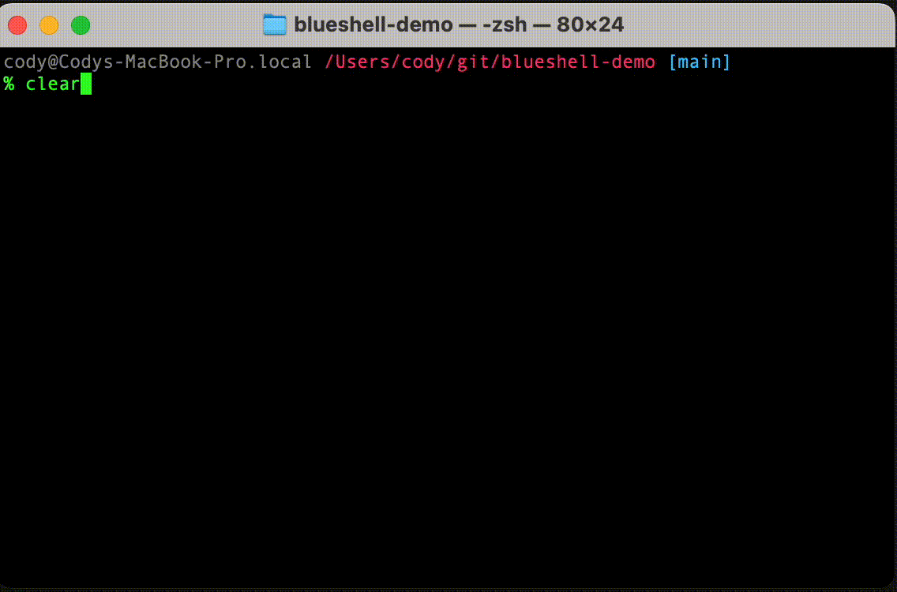

# blueshell-demo

Node (typescript) app that demonstrates basic usage of the [blueshell](https://github.com/6RiverSystems/blueshell) behavior tree library. See source in [app.ts](blob/main/app.ts)

## Usage

```bash
npm install
npn run build
npm start
```

Pressing any key will trigger a `valueChanged` event.  Press Ctrl-C to exit.

