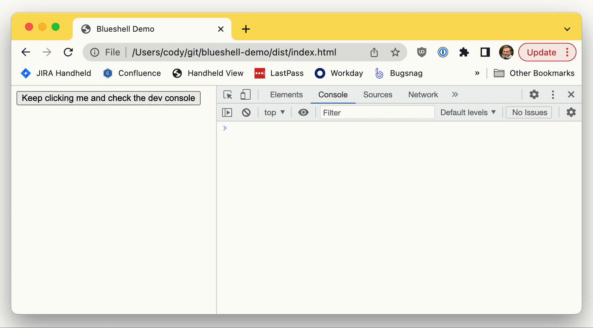
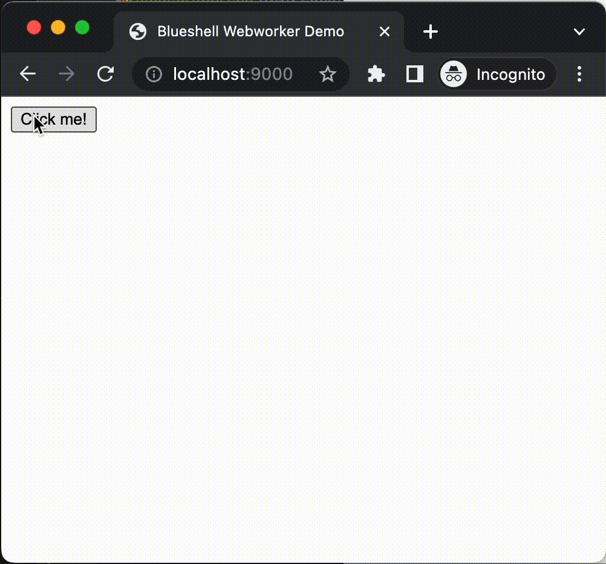

# blueshell-demo

Node (typescript) app that demonstrates basic usage of the [blueshell](https://github.com/6RiverSystems/blueshell) behavior tree library. Both browser-based and node.js sample apps are provided. 
All examples use a shared behavior tree implementation in [behavior-tree.ts](src/behavior-tree.ts)

## Web sample

Code is in [web.ts](src/web.ts).

To build and run:

```bash
npm install
npm run build-web
npm run start-web
```

* This should cause Chrome to open to the app immediately, which is served at: `http://localhost:9000/`

* Open the dev console. In Chrome, right click on the page > Inspect > Console tab.

* Clicking the button will trigger a `valueChanged` event.



## Browser Webworker sample

* Very similar to the single-threaded browser sample above, but this time the behavior tree code runs in a separate [web worker](https://developer.mozilla.org/en-US/docs/Web/API/Web_Workers_API/Using_web_workers).
* Code is in [webworker-web.ts](src/webworker-web.ts) and [webworker-worker.ts](src/webworker-worker.ts)
* Clicking the button will trigger a `valueChanged` event, which is displayed on the page this time.

To build and run:

```bash
npm install
npm run build-webworker
npm run start-webworker
```

* This should cause Chrome to open to the app immediately, which is served at: `http://localhost:9000/`



## Node.js sample

* Code is in [web.ts](src/web.ts)


To build and run:

```bash
npm install
npm run build-node
npm run start-node
```

* Pressing any key will trigger a `valueChanged` event.  

* Press Ctrl-C to exit.

